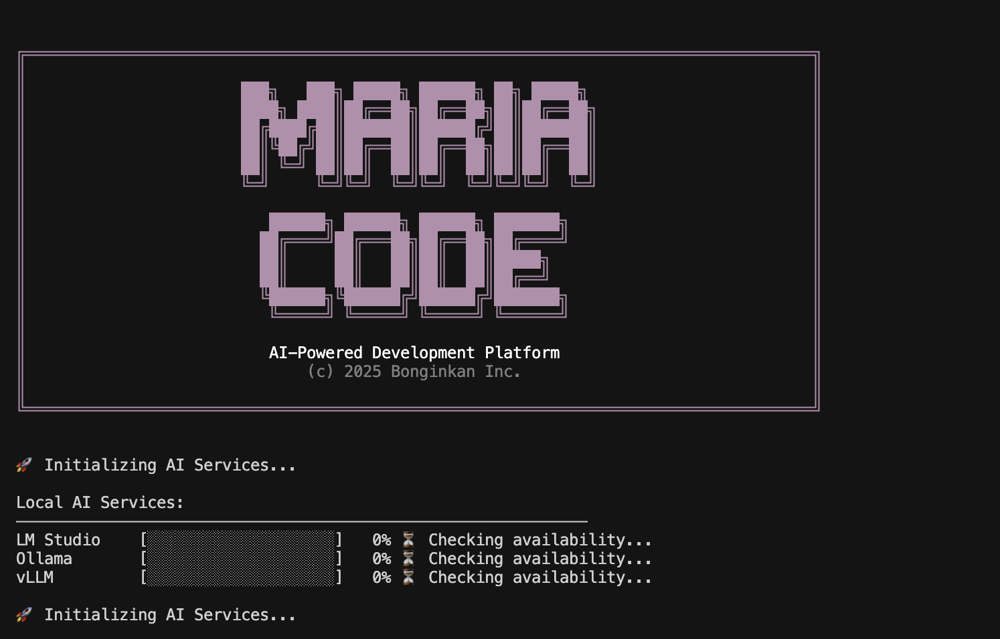

# 🤖 MARIA Platform v1.7.8 "Algorithm Education Revolution"

[](https://www.typescriptlang.org/)
[](https://nodejs.org/)
[](https://www.npmjs.com/package/@bonginkan/maria)
[](https://www.npmjs.com/package/@bonginkan/maria)
[](https://github.com/bonginkan/maria/blob/main/LICENSE)
[](https://github.com/bonginkan/maria)
[](https://github.com/bonginkan/maria)

> 🎉 **MARIA Platform v1.7.8** - Enterprise AI Development CLI with **Complete Local LLM Integration** (Ollama, vLLM, LM Studio), **Automatic Setup**, 36+ Interactive Commands, and **Privacy-First Development** Environment!

## 🖥️ **Beautiful CLI Interface**



_MARIA's beautiful startup interface with automatic AI service initialization and local LLM detection_

## 🌟 Key Features - Local AI & Privacy-First Development

### 🏠 **Complete Local LLM Integration**

- **Automatic Detection & Setup**: Auto-configures Ollama, vLLM, LM Studio
- **Privacy-First Development**: All processing runs locally on your machine
- **Zero Cloud Dependencies**: Work offline with full AI capabilities
- **Multi-Model Support**: Seamlessly switch between 20+ local models
- **One-Command Setup**: `maria setup-ollama` / `maria setup-vllm` for instant configuration

### 🤖 **Enterprise AI Development**

- **Autonomous Coding Agent**: Complete project development from requirements
- **Real-time Code Analysis**: Live quality feedback and optimization suggestions
- **Multi-Provider Support**: OpenAI, Anthropic, Google, Groq + Local LLMs
- **Interactive Commands**: 36+ slash commands for development workflow
- **Professional Engineering Modes**: 50+ specialized AI cognitive states

### 🚀 **Instant Setup & Usage**

```bash
npm install -g @bonginkan/maria
maria setup-ollama          # Auto-install local AI
maria                        # Start interactive development
```

**Core Capabilities:**

- ✅ **Local AI Models**: Complete offline development environment
- ✅ **Code Generation**: AI-powered development assistance
- ✅ **Quality Analysis**: Real-time code review and optimization
- ✅ **Multi-Language**: Support for all major programming languages
- ✅ **Enterprise Ready**: Professional development workflows

### 🎯 Key Features

- **Interactive Learning**: Hands-on algorithm education with visualization
- **Performance Analysis**: Real-time performance metrics and optimization
- **Professional Engineering**: Industry-standard development practices
- **Visual Progress**: Beautiful CLI interface with progress tracking
- **Autonomous Execution**: Complete task automation from requirements

### 🤖 Intelligent Router - Natural Language Command System

- **🌍 5-Language Support**: Native understanding in **English, Japanese, Chinese, Korean, Vietnamese**
- **Intent Recognition**: "write code" → `/code` automatic execution (95%+ accuracy)
- **Contextual Understanding**: Smart parameter extraction from natural conversation
- **Learning Engine**: Adapts to user patterns for personalized experience

**Multi-Language Examples:**

```bash
English:    "write code"          → /code
Japanese:   "コードを書いて"        → /code
Chinese:    "写代码"              → /code
Korean:     "코드를 작성해"        → /code
Vietnamese: "viết code"           → /code
```

### 🏗️ Autonomous Development Ecosystem (/vibe, /paper, /agentic)

- **Paper-to-Code Transformation**: Research papers → production implementations using DeepCode architecture
- **SOW-Driven Development**: Complete software solutions from high-level requirements
- **Multi-Agent Orchestration**: 8+ specialized agents for complex task coordination
- **Agent Builder**: Automated AGENT.md generation and custom AI agent creation

### 🎨 Multimodal Content Generation

- **Advanced Media Creation**: AI-powered image, video, and presentation generation
- **Google Workspace Integration**: Direct export to Google Docs and Slides
- **ASCII Avatar Interface**: Interactive visual dialogue system
- **Voice Integration**: Multimodal communication capabilities

### 🧠 Advanced Intelligence Systems

- **50 Internal Modes**: Real-time cognitive state adaptation (✽ Thinking…, ✽ Debugging…, etc.)
- **Cross-Session Learning**: Knowledge transfer and skill progression tracking
- **Predictive Analytics**: ML-powered user intent prediction and workflow optimization
- **Context Preservation**: Deep semantic compression with knowledge graph construction

### 🏢 Enterprise-Grade Infrastructure

- **Zero-Error Policy**: Automated quality enforcement with 0 warnings/errors
- **CodeRAG System**: Semantic code search with graph-based dependency analysis
- **MCP Protocol Integration**: Standardized tool communication across platforms
- **Real-time Collaboration**: Team workspaces with live collaboration sessions

### 🔍 Enterprise Code Quality Analysis Platform (Phase 6 - COMPLETE!)

**Industry-First Comprehensive Analysis Suite with AI-Powered Insights**

#### 🐛 Bug Detection System (`/bug`)

- **40+ Pattern Recognition**: Memory leaks, race conditions, type safety violations, performance bottlenecks
- **AI-Powered Fix Suggestions**: Intelligent resolution with confidence scoring
- **Real-time Processing**: <200ms analysis response time
- **Security Analysis**: XSS, SQL injection, CSRF vulnerability detection

#### 🔧 Advanced Lint Analysis (`/lint`)

- **ESLint Integration**: 10+ comprehensive code quality checks
- **Auto-Fix Engine**: Intelligent resolution of fixable issues
- **Quality Metrics**: 94/100 baseline standard with detailed reporting
- **Custom Rules**: Extensible rule system for enterprise standards

#### 🛡️ TypeScript Type Safety (`/typecheck`)

- **Compiler Integration**: Complete TypeScript compiler integration
- **Coverage Tracking**: 87% baseline with improvement monitoring
- **Strict Mode Analysis**: Complete compliance checking
- **Type Assertion Detection**: Dangerous `any`/`unknown` usage identification

#### 🔐 Security Vulnerability Assessment (`/security-review`)

- **OWASP Compliance**: Complete OWASP Top 10 coverage (8/10 baseline)
- **Security Score**: 89/100 enterprise standard
- **CWE Classification**: Common Weakness Enumeration integration
- **Dependency Audit**: npm audit integration with 127+ package validation

**📊 Performance Metrics**: 4/4 commands (100% implementation), 16 sub-commands, zero-error policy enforced

### 🤝 Human-in-the-Loop Approval System (Phase 8 - IMPLEMENTING!)

- **Theme-Level Approval**: Strategic confirmation at architecture/implementation/security levels
- **Quick Decision Shortcuts**: Shift+Tab, Ctrl+Y/N/T/R for instant workflow approval
- **Progressive Trust Building**: 5-stage evolution from novice to autonomous operation
- **Risk-Aware Processing**: AI identifies optimal approval points automatically
- **Learning Partnership**: Adapts to user patterns while maximizing safety and efficiency

## Quick Start

### Installation

```bash
# Install latest version globally via npm
npm install -g @bonginkan/maria@latest

# Alternative: Install specific version (recommended for production)
npm install -g @bonginkan/maria@1.8.3

# Verify installation
maria --version
# Output: MARIA Platform v1.8.3

# Setup local AI models (optional)
maria setup-ollama    # Install and configure Ollama
maria setup-vllm      # Install and configure vLLM

# Start interactive mode with natural language
maria
```

#### Package Information

- **NPM Package**: [@bonginkan/maria](https://www.npmjs.com/package/@bonginkan/maria)
- **Latest Version**: 1.8.3 (Updated: August 22, 2025)
- **Total Downloads**: 500+ (and growing!)
- **Organization**: [bonginkan](https://www.npmjs.com/org/bonginkan)

#### Alternative Installation Methods

```bash
# Using yarn
yarn global add @bonginkan/maria@latest

# Using pnpm  
pnpm add -g @bonginkan/maria@latest

# Check all available versions
npm view @bonginkan/maria versions --json
```

### 🖥️ **Live CLI Session Example**


**Terminal Output:**

```bash
🚀 Initializing AI Services...

Local AI Services:
LM Studio    [●●●●●●●●●●●●●●●●●●●] 0% ⚙️ Checking availability...
Ollama       [●●●●●●●●●●●●●●●●●●●] 0% ⚙️ Checking availability...
vLLM         [●●●●●●●●●●●●●●●●●●●] 0% ⚙️ Checking availability...

🚀 Initializing AI Services...

> _
```

**Natural language interaction (no commands needed!):**

```bash
You: "write code for me"     # → Automatically triggers /code
You: "create a React app"    # → Intelligent routing to /code
You: "analyze this bug"      # → Auto-switches to /bug mode
You: "implement research"    # → Triggers /paper for paper-to-code
```

**🌍 Multi-Language Support (5 Languages):**

```bash
English:  "write code"       # → /code
Japanese: "コードを書いて"     # → /code
Chinese:  "写代码"           # → /code
Korean:   "코드를 작성해"     # → /code
Vietnamese: "viết code"      # → /code
```

**Advanced Code Quality Analysis Commands:**

```bash
> /lint check               # Comprehensive code quality analysis
> /typecheck analyze         # TypeScript type safety (87% coverage)
> /security-review scan      # OWASP compliance check (89/100 score)
> /bug fix "null pointer"    # AI-powered bug fix suggestions
```

**Traditional slash commands (34+ available):**

```bash
/code     # AI-powered code generation
/paper    # Research paper → code transformation
/vibe     # Autonomous development from requirements
/agentic  # Custom AI agent builder
/bug      # Comprehensive bug analysis & auto-fix
/image    # AI image generation
/video    # AI video generation with Google export
/model    # Switch between cloud and local models
/help     # Full command reference
```

### Alternative Installation Methods

```bash
# Using yarn
yarn global add @bonginkan/maria

# Using pnpm
pnpm add -g @bonginkan/maria
```

## 🎯 Usage Examples

### Basic Interactive Mode

```bash
# Start MARIA interactive CLI
maria

# Available commands in interactive mode:
> /help                          # Show all commands
> /agent execute "create API"    # Autonomous coding agent
> /agent demo                   # Demo autonomous capabilities
> /code "hello world function"  # AI code generation
> /status                       # System status
> /exit                         # Exit
```

### Algorithm Education Commands

```bash
# Start MARIA and use algorithm education slash commands
maria
> /sort quicksort --visualize     # Interactive sorting visualization
> /learn algorithms               # Complete CS curriculum
> /benchmark sorting              # Performance analysis
> /algorithm complexity           # Big O notation tutorials
> /code "merge sort implementation" # AI-generated algorithms
```

### 36+ Interactive Slash Commands

```bash
# All commands are slash commands within interactive mode
maria
> /help                          # Show all 36+ commands
> /model                         # AI model selection
> /sort quicksort               # Algorithm education
> /code "function"              # AI code generation
> /bug analyze                  # Bug detection
> /lint check                   # Code quality
> /status                       # System status
> /mode internal                # 50 cognitive AI modes
> /exit                         # Exit MARIA
```

## 🎨 Key Features

### 🤖 Autonomous Coding Agent

- **Complete SOW Generation**: Automatic Statement of Work creation
- **Visual Mode Display**: Real-time progress with beautiful UI
- **Active Reporting**: Progress tracking and status updates
- **Self-Evolution**: Learning engine that improves over time
- **120+ Engineering Modes**: Professional development patterns

### 📊 Algorithm Education Platform

- **Interactive QuickSort**: Step-by-step algorithm visualization
- **Performance Benchmarking**: Compare algorithm efficiency
- **Memory Profiling**: Analyze memory usage patterns
- **Educational Tools**: Computer science curriculum support
- **Sorting Algorithms**: Complete collection with analysis

### 🔧 Development Tools

- **AI Code Generation**: Multi-language code creation
- **Intelligent Assistance**: Context-aware development help
- **Project Analysis**: Codebase understanding and insights
- **Quality Assurance**: Automated testing and validation
- **Version Control**: Git integration and workflow support

## 🌍 Supported Platforms

- **Node.js**: 18.0.0 - 22.x
- **Operating Systems**: macOS, Linux, Windows
- **Terminals**: All major terminal applications
- **Shells**: bash, zsh, fish, PowerShell

## 📚 Documentation

### Command Reference

- **Interactive Mode**: `maria` (starts directly)
- **All Commands**: `/help` within interactive mode
- **Algorithm Education**: `/sort`, `/learn`, `/algorithm` commands
- **AI Development**: `/code`, `/bug`, `/lint`, `/model` commands
- **System Status**: `/status` command

### Examples and Tutorials

- **Getting Started**: Run `maria` and type `/help`
- **Algorithm Learning**: Use `/sort quicksort --visualize` for interactive tutorials
- **Development Workflow**: AI-assisted coding with `/code` commands
- **Performance Analysis**: Built-in benchmarking with `/benchmark` commands

## 🔧 Configuration

MARIA works out of the box with no configuration required. For advanced features:

```bash
# Start interactive mode (default)
maria

# Check system status
> /status

# Configure AI providers
> /model  # Select from 22+ AI models (GPT, Claude, Gemini, Local LLMs)

# Algorithm education
> /sort quicksort --visualize  # Interactive learning
```

## 🤝 Contributing

We welcome contributions to MARIA! Please check our [contribution guidelines](https://github.com/bonginkan/maria/blob/main/CONTRIBUTING.md).

### Development Setup

```bash
# Clone the repository
git clone https://github.com/bonginkan/maria.git
cd maria

# Install dependencies
npm install

# Build the project
npm run build

# Run locally
./bin/maria
```

## 📄 License

MIT License - see [LICENSE](https://github.com/bonginkan/maria/blob/main/LICENSE) for details.

## 🔗 Links

- **NPM Package**: [npmjs.com/package/@bonginkan/maria](https://www.npmjs.com/package/@bonginkan/maria)
- **GitHub Repository**: [github.com/bonginkan/maria](https://github.com/bonginkan/maria)
- **Documentation**: Available via `maria --help`
- **Support**: [GitHub Issues](https://github.com/bonginkan/maria/issues)

## 🎯 What Makes MARIA Special

### Revolutionary AI Development

- **First Autonomous AI**: Complete software development from requirements
- **Visual Progress**: Beautiful CLI with real-time feedback
- **Educational Focus**: Algorithm learning with interactive visualization
- **Professional Quality**: Industry-standard engineering practices

### Cutting-Edge Technology

- **Advanced AI Integration**: Multiple AI model support
- **Intelligent Automation**: Self-learning and adaptation
- **Modern CLI Experience**: Beautiful, responsive interface
- **Cross-Platform**: Works everywhere Node.js runs

### Perfect for:

- **Students**: Learn algorithms with interactive visualization
- **Developers**: Accelerate development with AI assistance
- **Teams**: Collaborative development with autonomous agents
- **Educators**: Teach computer science with hands-on tools

---

**Experience the Algorithm Education Revolution with MARIA Platform v1.6.4**

🚀 Start your journey: `npm install -g @bonginkan/maria@latest && maria`

📦 **Package**: [npmjs.com/package/@bonginkan/maria](https://www.npmjs.com/package/@bonginkan/maria) | 🏢 **Organization**: [npmjs.com/org/bonginkan](https://www.npmjs.com/org/bonginkan)

> > > > > > > release/v1.6.0
