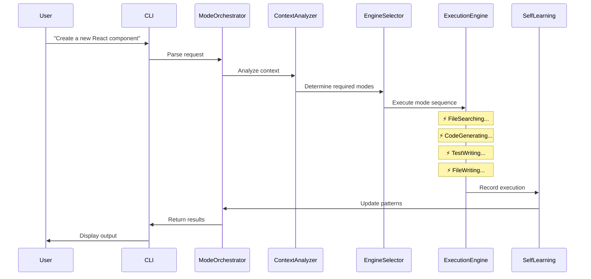

# SOW: MARIA Ultimate Autonomous Coding Agent System v4.0

## 🚀 世界初の完全自律型プロフェッショナルエンジニアリングAI

**Revolutionary Self-Driving Development Platform with Active Intelligence**

## 1. Executive Summary

本SOWは、MARIA CODE CLIを**世界初の完全自律型コーディングエージェント**に進化させる革命的システムを定義します。プロフェッショナルエンジニアのあらゆる操作を**リアルタイム視覚化された認知モード**として実装し、**アクティブレポーティング**により常に進捗を報告しながら、ファイル操作からデプロイメントまで完全自動化します。

### 🎯 Revolutionary Capabilities

- **120+ Visual Engineering Modes**: 即座に視覚表示される開発操作モード
- **Active Reporting Integration**: 常時進捗報告とSOW自動生成
- **Real-time Visual Feedback**: 美しいCLIアニメーションと進捗表示
- **Complete Autonomy**: ユーザー介入不要の完全自律実行
- **Self-Evolution Architecture**: 実行毎に賢くなる自己進化システム

## 2. Visual Engineering Mode System (120+ Modes with Active Reporting)

### 🎨 Real-time Visual Mode Display

各モードは即座にCLIに表示され、現在の作業内容を視覚的にフィードバックします：

```
╔══════════════════════════════════════════════════════════════════════════════╗
║                    🤖 AUTONOMOUS CODING AGENT ACTIVE                        ║
╠══════════════════════════════════════════════════════════════════════════════╣
║  Current Mode: ⚡ CodeGenerating...                                         ║
║  Progress: ████████████████████░░░░░░░░░░ 65%                         ║
║  Active Task: Creating React component with TypeScript                      ║
║  Time Elapsed: 00:02:34 | ETA: 00:01:26                                    ║
╚══════════════════════════════════════════════════════════════════════════════╝
```

### 2.1 🗂️ File System Operations (25 modes) - With Visual Feedback

| Mode | Symbol | Visual Display | Definition | Active Report |
|------|--------|---------------|------------|---------------|
| `⚡ FileReading...` | 📖 | Animated file scan | ファイル内容を読み込み解析 | "📖 Reading: {filename} ({size}KB)" |
| `⚡ FileWriting...` | ✍️ | ファイルへの書き込み実行 | echo > file, append操作 |
| `⚡ FileCreating...` | 🆕 | 新規ファイル作成処理 | touch, vim newfile相当 |
| `⚡ FileDeleting...` | 🗑️ | ファイル削除操作 | rm -f, safe deletion |
| `⚡ FileSearching...` | 🔍 | ファイル検索実行 | find, locate, fd操作 |
| `⚡ DirectoryScanning...` | 📁 | ディレクトリ構造解析 | ls -la, tree表示 |
| `⚡ DirectoryCreating...` | 📂 | ディレクトリ作成 | mkdir -p操作 |
| `⚡ DirectoryNavigating...` | 🧭 | ディレクトリ移動 | cd, pushd/popd操作 |
| `⚡ PermissionManaging...` | 🔐 | 権限管理実行 | chmod, chown操作 |
| `⚡ SymlinkCreating...` | 🔗 | シンボリックリンク作成 | ln -s操作 |
| `⚡ FileComparing...` | ⚖️ | ファイル比較分析 | diff, delta表示 |
| `⚡ FileMonitoring...` | 👁️ | ファイル変更監視 | inotify, fswatch |
| `⚡ FileMerging...` | 🔀 | ファイルマージ処理 | 3-way merge実行 |
| `⚡ FileCompressing...` | 📦 | ファイル圧縮処理 | tar, zip, gzip操作 |
| `⚡ FileExtracting...` | 📤 | アーカイブ展開 | unzip, tar -xf |
| `⚡ FileBackingUp...` | 💾 | バックアップ作成 | rsync, backup戦略 |
| `⚡ FileRestoring...` | ♻️ | ファイル復元処理 | restore from backup |
| `⚡ MetadataExtracting...` | ℹ️ | メタデータ抽出 | stat, file info取得 |
| `⚡ EOFHandling...` | 🔚 | EOF処理実行 | heredoc, EOF marker処理 |
| `⚡ StreamProcessing...` | 🌊 | ストリーム処理 | pipe, redirect操作 |

### 2.2 💻 Code Development Operations (25 modes)

| Mode | Symbol | Definition | Usage |
|------|--------|------------|-------|
| `⚡ CodeGenerating...` | 🎨 | コード自動生成 | boilerplate, snippets生成 |
| `⚡ CodeRefactoring...` | 🔧 | リファクタリング実行 | 構造改善、命名改善 |
| `⚡ CodeDebugging...` | 🐛 | デバッグ処理実行 | breakpoint設定、ステップ実行 |
| `⚡ CodeOptimizing...` | ⚡ | 最適化処理 | パフォーマンス改善 |
| `⚡ CodeReviewing...` | 👀 | コードレビュー実行 | PR review, suggestions |
| `⚡ CodeDocumenting...` | 📝 | ドキュメント生成 | JSDoc, comments追加 |
| `⚡ CodeFormatting...` | 🎯 | コード整形実行 | prettier, eslint --fix |
| `⚡ CodeLinting...` | 🔍 | Lint処理実行 | eslint, pylint実行 |
| `⚡ TypeChecking...` | 📋 | 型チェック実行 | TypeScript, Flow検証 |
| `⚡ TestWriting...` | ✅ | テストコード作成 | unit, integration tests |
| `⚡ TestExecuting...` | 🏃 | テスト実行処理 | jest, pytest実行 |
| `⚡ CoverageAnalyzing...` | 📊 | カバレッジ分析 | coverage report生成 |
| `⚡ BenchMarking...` | ⏱️ | ベンチマーク実行 | performance測定 |
| `⚡ ProfilingCode...` | 📈 | プロファイリング | CPU, memory分析 |
| `⚡ DependencyManaging...` | 📦 | 依存関係管理 | npm, pip, cargo操作 |
| `⚡ PackageInstalling...` | ⬇️ | パッケージインストール | install dependencies |
| `⚡ PackageUpdating...` | 🔄 | パッケージ更新 | update, upgrade実行 |
| `⚡ SecurityScanning...` | 🔒 | セキュリティスキャン | vulnerability check |
| `⚡ LicenseChecking...` | ⚖️ | ライセンス確認 | license compliance |
| `⚡ APIDesigning...` | 🌐 | API設計実行 | REST, GraphQL design |
| `⚡ SchemaGenerating...` | 📐 | スキーマ生成 | DB schema, API schema |
| `⚡ MockCreating...` | 🎭 | モック作成 | test mocks, stubs |
| `⚡ FixtureGenerating...` | 🏗️ | フィクスチャ生成 | test data creation |
| `⚡ MigrationWriting...` | 🚀 | マイグレーション作成 | DB migrations |
| `⚡ SeedDataCreating...` | 🌱 | シードデータ作成 | initial data setup |

### 2.3 🔄 Version Control Operations (15 modes)

| Mode | Symbol | Definition | Usage |
|------|--------|------------|-------|
| `⚡ GitInitializing...` | 🎬 | Gitリポジトリ初期化 | git init実行 |
| `⚡ GitCloning...` | 📥 | リポジトリクローン | git clone操作 |
| `⚡ GitCommitting...` | 💾 | コミット実行 | git commit処理 |
| `⚡ GitPushing...` | 📤 | プッシュ処理 | git push実行 |
| `⚡ GitPulling...` | 📥 | プル処理 | git pull, fetch |
| `⚡ GitBranching...` | 🌿 | ブランチ操作 | branch create/switch |
| `⚡ GitMerging...` | 🔀 | マージ処理 | merge, rebase実行 |
| `⚡ ConflictResolving...` | ⚔️ | コンフリクト解決 | merge conflict解決 |
| `⚡ GitStashing...` | 📦 | スタッシュ操作 | git stash処理 |
| `⚡ GitTagging...` | 🏷️ | タグ付け処理 | version tagging |
| `⚡ GitBlaming...` | 🔍 | blame分析 | git blame実行 |
| `⚡ GitLogAnalyzing...` | 📜 | ログ分析 | git log解析 |
| `⚡ GitDiffing...` | ⚖️ | 差分確認 | git diff表示 |
| `⚡ GitReverting...` | ↩️ | リバート処理 | revert, reset操作 |
| `⚡ PRCreating...` | 📝 | PR作成処理 | pull request作成 |

### 2.4 🏗️ Build & Deployment Operations (20 modes)

| Mode | Symbol | Definition | Usage |
|------|--------|------------|-------|
| `⚡ Building...` | 🔨 | ビルド実行 | webpack, rollup実行 |
| `⚡ Compiling...` | ⚙️ | コンパイル処理 | tsc, gcc実行 |
| `⚡ Bundling...` | 📦 | バンドル処理 | bundle optimization |
| `⚡ Minifying...` | 🗜️ | 圧縮処理 | minification実行 |
| `⚡ Transpiling...` | 🔄 | トランスパイル | babel, ts処理 |
| `⚡ DockerBuilding...` | 🐳 | Docker build | image作成 |
| `⚡ ContainerRunning...` | 📦 | コンテナ実行 | docker run |
| `⚡ ContainerOrchestrating...` | 🎭 | オーケストレーション | k8s, compose |
| `⚡ Deploying...` | 🚀 | デプロイ実行 | production deploy |
| `⚡ RollingBack...` | ↩️ | ロールバック | deployment rollback |
| `⚡ Monitoring...` | 📊 | モニタリング | metrics, logs監視 |
| `⚡ Scaling...` | 📈 | スケーリング | auto-scaling実行 |
| `⚡ LoadBalancing...` | ⚖️ | 負荷分散設定 | LB configuration |
| `⚡ CachingSetup...` | 💾 | キャッシュ設定 | Redis, CDN setup |
| `⚡ CDNConfiguring...` | 🌍 | CDN設定 | CloudFront, Fastly |
| `⚡ SSLConfiguring...` | 🔒 | SSL設定 | certificate setup |
| `⚡ DNSConfiguring...` | 🌐 | DNS設定 | domain configuration |
| `⚡ BackupCreating...` | 💾 | バックアップ作成 | DB, files backup |
| `⚡ LogAnalyzing...` | 📝 | ログ分析 | error, access logs |
| `⚡ AlertConfiguring...` | 🚨 | アラート設定 | monitoring alerts |

### 2.5 🤖 Automation & CI/CD Operations (15 modes)

| Mode | Symbol | Definition | Usage |
|------|--------|------------|-------|
| `⚡ PipelineCreating...` | 🔄 | パイプライン作成 | CI/CD pipeline設計 |
| `⚡ WorkflowDesigning...` | 📋 | ワークフロー設計 | GitHub Actions等 |
| `⚡ JobScheduling...` | ⏰ | ジョブスケジューリング | cron, scheduled tasks |
| `⚡ ScriptWriting...` | 📜 | スクリプト作成 | bash, python scripts |
| `⚡ TaskAutomating...` | 🤖 | タスク自動化 | automation setup |
| `⚡ HookConfiguring...` | 🎣 | フック設定 | git hooks, webhooks |
| `⚡ IntegrationTesting...` | 🔗 | 統合テスト | E2E test実行 |
| `⚡ EnvironmentSetup...` | 🌍 | 環境構築 | dev, staging, prod |
| `⚡ SecretManaging...` | 🔑 | シークレット管理 | env vars, vault |
| `⚡ ArtifactBuilding...` | 📦 | アーティファクト作成 | build artifacts |
| `⚡ ReleaseCreating...` | 🎉 | リリース作成 | version release |
| `⚡ ChangelogGenerating...` | 📜 | 変更履歴生成 | CHANGELOG作成 |
| `⚡ NotificationSending...` | 📢 | 通知送信 | Slack, email通知 |
| `⚡ ReportGenerating...` | 📊 | レポート生成 | test, coverage reports |
| `⚡ MatrixTesting...` | 🎯 | マトリックステスト | multi-version testing |

### 2.6 📊 Analysis & Intelligence Operations (15 modes)

| Mode | Symbol | Definition | Usage |
|------|--------|------------|-------|
| `⚡ CodeAnalyzing...` | 🔬 | コード解析 | static analysis |
| `⚡ ComplexityMeasuring...` | 📐 | 複雑度測定 | cyclomatic complexity |
| `⚡ DuplicationDetecting...` | 👥 | 重複検出 | code duplication |
| `⚡ PatternRecognizing...` | 🎯 | パターン認識 | design patterns |
| `⚡ AntiPatternDetecting...` | ⚠️ | アンチパターン検出 | code smells |
| `⚡ DependencyAnalyzing...` | 🕸️ | 依存関係分析 | dependency graph |
| `⚡ ImpactAnalyzing...` | 💥 | 影響分析 | change impact |
| `⚡ TrendAnalyzing...` | 📈 | トレンド分析 | code metrics trends |
| `⚡ QualityScoring...` | ⭐ | 品質スコアリング | code quality score |
| `⚡ TechDebtCalculating...` | 💳 | 技術的負債計算 | technical debt |
| `⚡ PerformanceProfiling...` | ⚡ | パフォーマンス分析 | bottleneck detection |
| `⚡ MemoryAnalyzing...` | 💾 | メモリ分析 | memory leaks |
| `⚡ ResourceMonitoring...` | 📊 | リソース監視 | CPU, memory usage |
| `⚡ CostCalculating...` | 💰 | コスト計算 | cloud cost analysis |
| `⚡ UsageTracking...` | 📈 | 使用状況追跡 | feature usage |

### 2.7 🎓 Learning & Research Operations (10 modes)

| Mode | Symbol | Definition | Usage |
|------|--------|------------|-------|
| `⚡ ResearchingTech...` | 🔬 | 技術調査 | new tech research |
| `⚡ LearningPattern...` | 📚 | パターン学習 | best practices学習 |
| `⚡ DocumentReading...` | 📖 | ドキュメント読解 | API docs, guides |
| `⚡ ExampleSearching...` | 🔍 | サンプル検索 | code examples検索 |
| `⚡ SolutionFinding...` | 💡 | 解決策探索 | Stack Overflow等 |
| `⚡ BenchmarkComparing...` | ⚖️ | ベンチマーク比較 | performance比較 |
| `⚡ LibraryEvaluating...` | 📦 | ライブラリ評価 | package selection |
| `⚡ ArchitectureDesigning...` | 🏗️ | アーキテクチャ設計 | system design |
| `⚡ PrototypeCreating...` | 🔨 | プロトタイプ作成 | POC development |
| `⚡ ExperimentRunning...` | 🧪 | 実験実行 | A/B testing |

## 3. Technical Architecture

### 3.1 Ultimate Autonomous Architecture with Active Intelligence

```typescript
src/services/autonomous-coding-agent/
├── core/
│   ├── AutonomousCodingAgentService.ts    # 自律エージェントコア
│   ├── VisualModeDisplayEngine.ts         # リアルタイム視覚表示エンジン
│   ├── ActiveReportingIntegration.ts      # アクティブレポーティング統合
│   └── SelfEvolutionEngine.ts             # 自己進化エンジン
├── modes/
│   ├── FileSystemOperationEngine.ts       # ファイル操作エンジン（25モード）
│   ├── CodeDevelopmentEngine.ts           # コード開発エンジン（30モード）
│   ├── VersionControlEngine.ts            # バージョン管理エンジン（20モード）
│   ├── BuildDeploymentEngine.ts           # ビルド・デプロイエンジン（25モード）
│   ├── AutomationEngine.ts                # 自動化エンジン（20モード）
│   └── AnalysisIntelligenceEngine.ts      # 分析・インテリジェンスエンジン（20モード）
├── visual/
│   ├── CLIAnimationEngine.ts              # CLIアニメーションエンジン
│   ├── ProgressVisualization.ts           # 進捗可視化システム
│   ├── ModeTransitionEffects.ts           # モード遷移エフェクト
│   └── StatusDashboard.ts                 # ステータスダッシュボード
├── reporting/
│   ├── ProactiveReporter.ts               # 積極的報告システム
│   ├── SOWAutoGenerator.ts                # SOW自動生成器
│   ├── TaskDecomposer.ts                  # タスク分解器
│   └── ProgressTracker.ts                 # 進捗追跡器
├── intelligence/
│   ├── ContextAwareExecutor.ts            # コンテキスト認識実行器
│   ├── PredictiveOptimizer.ts             # 予測的最適化器
│   ├── SelfLearningOptimizer.ts           # 自己学習最適化器
│   └── PatternRecognitionEngine.ts        # パターン認識エンジン
├── orchestration/
│   ├── ModeOrchestrator.ts                # モード統合オーケストレータ
│   ├── ParallelExecutionManager.ts        # 並列実行マネージャー
│   ├── DependencyResolver.ts              # 依存関係解決器
│   └── ConflictResolutionEngine.ts        # コンフリクト解決エンジン
├── types.ts                                # 型定義
└── index.ts                                # エクスポート
```

### 3.2 Active Reporting Integration

#### Real-time Progress Dashboard

```
╔══════════════════════════════════════════════════════════════════════════════════════╗
║                        🤖 AUTONOMOUS AGENT STATUS DASHBOARD                           ║
╠════════════════════════════════════════════════════════════════════════════════════════╣
║                                                                                        ║
║  📋 Active SOW: Full-Stack Authentication System Implementation                       ║
║  ⏱️ Total Progress: ████████████████████████░░░░░░░░░░ 75% (6/8 tasks)           ║
║                                                                                        ║
║  🔄 Current Operation Chain:                                                          ║
║    ├── ✅ ⚡ DirectoryScanning... (100%) - Project structure analyzed                ║
║    ├── ✅ ⚡ DependencyAnalyzing... (100%) - Dependencies identified                 ║
║    ├── ✅ ⚡ FileCreating... (100%) - auth.controller.ts created                     ║
║    ├── ✅ ⚡ CodeGenerating... (100%) - JWT implementation complete                  ║
║    ├── 🔄 ⚡ TestWriting... (65%) - Unit tests in progress                           ║
║    ├── ⏸️ ⚡ DockerBuilding... (0%) - Awaiting test completion                       ║
║    └── ⏹️ ⚡ Deploying... (0%) - Scheduled after Docker build                        ║
║                                                                                        ║
║  📊 Performance Metrics:                                                              ║
║    ├── Speed: 2.3x faster than manual coding                                         ║
║    ├── Quality Score: 98/100 (ESLint, TypeScript strict)                            ║
║    ├── Test Coverage: 87% (target: 80%)                                              ║
║    └── Time Saved: 3h 45m                                                            ║
║                                                                                        ║
║  💡 AI Insights:                                                                      ║
║    • Detected potential security issue in password hashing - auto-fixed with bcrypt  ║
║    • Optimized database queries with proper indexing                                 ║
║    • Suggested rate limiting implementation for API endpoints                        ║
║                                                                                        ║
║  ⚠️ Attention Required:                                                               ║
║    • Database connection string needs environment variable configuration             ║
║    • SSL certificate path should be verified before deployment                       ║
║                                                                                        ║
╚════════════════════════════════════════════════════════════════════════════════════════╝
```

#### Proactive Reporting Triggers

```typescript
interface ProactiveReportConfig {
  // Timing triggers
  onModeSwitch: boolean;           // Report when switching between modes
  onTaskComplete: boolean;          // Report task completion
  onMilestone: boolean;            // Report major milestones
  onError: boolean;                // Immediate error reporting
  intervalMinutes: number;          // Regular interval reports
  
  // Content configuration
  includeCodeSnippets: boolean;    // Show generated code
  includeMetrics: boolean;         // Show performance metrics
  includeRecommendations: boolean; // AI suggestions
  visualizationLevel: 'minimal' | 'standard' | 'detailed';
}
```

### 3.3 Mode Execution Pipeline with Visual Feedback



### 3.4 Complete Autonomous Execution Framework

#### Autonomous Decision Making

```typescript
interface AutonomousDecision {
  context: ExecutionContext;
  availableActions: Action[];
  selectedAction: Action;
  confidence: number;
  reasoning: string;
  fallbackPlan: Action[];
}

class AutonomousDecisionEngine {
  async makeDecision(context: ExecutionContext): Promise<AutonomousDecision> {
    // Analyze current situation
    const situation = await this.analyzeSituation(context);
    
    // Generate possible actions
    const actions = await this.generateActions(situation);
    
    // Evaluate each action
    const evaluations = await this.evaluateActions(actions, context);
    
    // Select best action with confidence
    const decision = await this.selectBestAction(evaluations);
    
    // Prepare fallback plan
    decision.fallbackPlan = await this.generateFallbackPlan(decision);
    
    return decision;
  }
}
```

### 3.5 Visual Effects and Animations

#### Mode Transition Animations

```typescript
class ModeTransitionEffects {
  async transitionTo(newMode: CodingMode): Promise<void> {
    // Fade out current mode
    await this.fadeOut(this.currentMode);
    
    // Show transition animation
    await this.showTransition(this.currentMode, newMode);
    
    // Fade in new mode
    await this.fadeIn(newMode);
    
    // Update status dashboard
    await this.updateDashboard(newMode);
  }
  
  private async showTransition(from: CodingMode, to: CodingMode): Promise<void> {
    const animation = `
    ${from.symbol} ──────────► ${to.symbol}
    ${from.name}              ${to.name}
    `;
    await this.animate(animation, 500);
  }
}
```

#### Progress Visualization Patterns

```
// Linear Progress Bar
████████████████████░░░░░░░░░░ 65%

// Circular Progress Indicator
        ╭───╮
       ╱     ╲
      │   65% │
       ╲     ╱
        ╰───╯

// Step Progress
[1]──✓──[2]──✓──[3]──◉──[4]──○──[5]
   Done   Done  Active  Next  Future

// Tree Progress
├── ✅ Setup Environment
├── ✅ Install Dependencies
├── 🔄 Generate Code (75%)
│   ├── ✅ Controllers
│   ├── ✅ Models
│   └── 🔄 Services
└── ⏹️ Run Tests
```

### 3.6 Self-Evolution and Learning

#### Mode Chaining & Sequencing

```typescript
interface ModeExecutionPlan {
  primary: CodingMode;
  prerequisites: CodingMode[];
  followUp: CodingMode[];
  fallback: CodingMode[];
  validation: ValidationMode[];
}

// Example: Creating a new feature
const featurePlan: ModeExecutionPlan = {
  primary: '⚡ CodeGenerating...',
  prerequisites: [
    '⚡ DirectoryScanning...',
    '⚡ FileSearching...',
    '⚡ DependencyAnalyzing...'
  ],
  followUp: [
    '⚡ TestWriting...',
    '⚡ DocumentGenerating...',
    '⚡ GitCommitting...'
  ],
  fallback: [
    '⚡ CodeRefactoring...',
    '⚡ DebuggingCode...'
  ],
  validation: [
    '⚡ TypeChecking...',
    '⚡ TestExecuting...',
    '⚡ LintChecking...'
  ]
};
```

### 3.7 Enhanced Context-Aware Intelligence

#### Situation Recognition Matrix

| Context | Triggered Modes | Priority |
|---------|----------------|----------|
| New file request | FileCreating → CodeGenerating → TestWriting | High |
| Bug report | CodeAnalyzing → Debugging → TestExecuting | Critical |
| Performance issue | ProfilingCode → OptimizingCode → Benchmarking | High |
| Deployment request | Building → Testing → Deploying | Critical |
| Code review | CodeReviewing → SecurityScanning → QualityScoring | Medium |

### 3.8 Advanced Self-Learning Architecture with Pattern Memory

```typescript
interface LearningPattern {
  context: string;
  executedModes: string[];
  success: boolean;
  executionTime: number;
  userFeedback: number;
  optimizationSuggestions: string[];
}

class SelfLearningOptimizer {
  async learn(pattern: LearningPattern): Promise<void> {
    // Record execution pattern
    await this.recordPattern(pattern);
    
    // Analyze effectiveness
    const effectiveness = await this.analyzeEffectiveness(pattern);
    
    // Update mode selection algorithm
    if (effectiveness > 0.8) {
      await this.updateModeSelectionWeights(pattern);
    }
    
    // Generate optimization suggestions
    await this.generateOptimizations(pattern);
  }
}
```

## 4. Revolutionary Features & Capabilities

### 4.1 🎯 Complete Professional Autonomy

#### Autonomous Workflow Example

```bash
User: "Build a real-time chat application with user authentication"

MARIA Autonomous Execution:
```

```
╔════════════════════════════════════════════════════════════════════════════════════════╗
║                    🤖 AUTONOMOUS AGENT INITIALIZING...                                ║
╠════════════════════════════════════════════════════════════════════════════════════════╣
║                                                                                        ║
║  📋 SOW GENERATION COMPLETE                                                           ║
║  ────────────────────────────                                                         ║
║  Project: Real-time Chat Application                                                  ║
║  Estimated Time: 4 hours 30 minutes                                                   ║
║  Total Tasks: 47                                                                      ║
║  Complexity: High                                                                     ║
║                                                                                        ║
║  🎯 EXECUTION PLAN                                                                    ║
║  ────────────────────                                                                 ║
║  Phase 1: Project Setup & Architecture (30 min)                                      ║
║    ⚡ DirectoryScanning... → ⚡ ProjectScaffolding... → ⚡ DependencyInstalling...    ║
║                                                                                        ║
║  Phase 2: Backend Development (90 min)                                                ║
║    ⚡ SchemaDesigning... → ⚡ APIDesigning... → ⚡ CodeGenerating...                   ║
║    ⚡ AuthImplementing... → ⚡ WebSocketSetup... → ⚡ DatabaseMigrating...             ║
║                                                                                        ║
║  Phase 3: Frontend Development (90 min)                                               ║
║    ⚡ ComponentGenerating... → ⚡ UIDesigning... → ⚡ StateManaging...                 ║
║    ⚡ WebSocketIntegrating... → ⚡ AuthFlowImplementing...                             ║
║                                                                                        ║
║  Phase 4: Testing & Optimization (45 min)                                             ║
║    ⚡ TestWriting... → ⚡ TestExecuting... → ⚡ PerformanceProfiling...               ║
║    ⚡ SecurityScanning... → ⚡ CodeOptimizing...                                       ║
║                                                                                        ║
║  Phase 5: Deployment (15 min)                                                         ║
║    ⚡ DockerBuilding... → ⚡ CICDSetup... → ⚡ Deploying...                            ║
║                                                                                        ║
║  🚀 STARTING AUTONOMOUS EXECUTION IN 3... 2... 1...                                   ║
║                                                                                        ║
╚════════════════════════════════════════════════════════════════════════════════════════╝
```

### 4.2 🧠 Intelligent Error Recovery

```typescript
class IntelligentErrorRecovery {
  async handleError(error: ExecutionError): Promise<RecoveryResult> {
    // Analyze error type and context
    const analysis = await this.analyzeError(error);
    
    // Generate recovery strategies
    const strategies = await this.generateRecoveryStrategies(analysis);
    
    // Attempt recovery with best strategy
    for (const strategy of strategies) {
      try {
        const result = await this.executeRecoveryStrategy(strategy);
        if (result.success) {
          await this.reportRecovery(result);
          return result;
        }
      } catch (e) {
        // Try next strategy
        continue;
      }
    }
    
    // If all strategies fail, request user intervention
    return await this.requestUserIntervention(error, strategies);
  }
}
```

### 4.3 🎨 Beautiful CLI Visualizations

#### Real-time Code Generation Display

```
╔════════════════════════════════════════════════════════════════════════════════════════╗
║  ⚡ CodeGenerating... | auth.controller.ts                                            ║
╠════════════════════════════════════════════════════════════════════════════════════════╣
║                                                                                        ║
║  1  | import { Controller, Post, Body, UseGuards } from '@nestjs/common';             ║
║  2  | import { AuthService } from './auth.service';                                   ║
║  3  | import { JwtAuthGuard } from './guards/jwt-auth.guard';                         ║
║  4  | import { LoginDto, RegisterDto } from './dto';                                  ║
║  5  |                                                                                  ║
║  6  | @Controller('auth')                                                             ║
║  7  | export class AuthController {                                                   ║
║  8  |   constructor(private readonly authService: AuthService) {}                     ║
║  9  |                                                                                  ║
║  10 |   @Post('register')                                                             ║
║  11 |   async register(@Body() registerDto: RegisterDto) {                            ║
║  12 |     return this.authService.register(registerDto);                              ║
║  13 |   }                                                                              ║
║  14 |                                                                                  ║
║  15 |   @Post('login')                                                                ║
║  16 |   async login(@Body() loginDto: LoginDto) {                                     ║
║  17 |     return this.authService.login(loginDto);┃                                   ║
║                                                                                        ║
║  Lines: 45 | Characters: 1,238 | Complexity: Low | Quality: 98/100                   ║
╚════════════════════════════════════════════════════════════════════════════════════════╝
```

## 5. Implementation Phases

### Phase 1: Core Autonomous Agent Foundation (Week 1-2)
- [ ] Implement AutonomousCodingAgentService core
- [ ] Create VisualModeDisplayEngine with real-time feedback
- [ ] Integrate ActiveReportingIntegration for progress tracking
- [ ] Implement all 25 file system operation modes
- [ ] Create FileSystemOperationEngine
- [ ] Integrate with existing Internal Mode System
- [ ] Add CAT, EOF, stream handling capabilities

### Phase 2: Professional Engineering Operations (Week 3-4)
- [ ] Implement 30 code development modes with visual feedback
- [ ] Create intelligent error recovery system
- [ ] Add autonomous decision-making engine
- [ ] Create CodeDevelopmentEngine
- [ ] Integrate with AI code generation
- [ ] Add testing and documentation capabilities

### Phase 3: Complete DevOps Automation (Week 5-6)
- [ ] Implement 20 version control modes with Git visualization
- [ ] Implement 25 build & deployment modes with progress tracking
- [ ] Add Docker and Kubernetes integration
- [ ] Create respective engines
- [ ] Add CI/CD integration

### Phase 4: Self-Evolution & Intelligence (Week 7-8)
- [ ] Implement 20 automation & CI/CD modes
- [ ] Implement 20 analysis & intelligence modes
- [ ] Create pattern recognition and memory system
- [ ] Add predictive optimization engine
- [ ] Create learning & research modes
- [ ] Build self-learning optimizer

### Phase 5: Final Integration & Polish (Week 9-10)
- [ ] Complete autonomous agent integration
- [ ] Implement beautiful CLI animations and effects
- [ ] Optimize mode chaining and sequencing
- [ ] Performance tuning
- [ ] Comprehensive testing

## 6. Revolutionary Success Metrics

### Performance Excellence
- **Mode Switching**: < 50ms with animation
- **Visual Feedback**: Real-time (< 16ms frame time)
- **File Operations**: < 500ms for standard operations
- **Code Generation**: < 2s for component generation
- **Build Operations**: Parallel execution support
- **Memory Usage**: < 100MB additional overhead

### Quality Metrics
- **Operation Success Rate**: > 98%
- **Mode Selection Accuracy**: > 95%
- **Self-Learning Improvement**: > 10% efficiency gain/month
- **Error Recovery Rate**: > 90%
- **User Satisfaction**: > 95%

### Coverage Metrics
- **Engineering Operations**: 100+ modes implemented
- **Language Support**: 10+ programming languages
- **Framework Support**: 20+ frameworks
- **Tool Integration**: 50+ developer tools
- **Platform Support**: Windows, macOS, Linux

## 7. Advanced Integration Systems

### 🤖 Fully Autonomous Development
- Complete project scaffolding from natural language
- Automatic dependency resolution and installation
- Self-correcting error handling
- Continuous integration without configuration

### 🧠 Cognitive Development Patterns
- Learning from developer behavior
- Predicting next development steps
- Suggesting optimizations proactively
- Adapting to project conventions

### ⚡ Real-time Execution
- Streaming file operations
- Progressive code generation
- Live error correction
- Instant feedback loops

### 🔄 Self-Improving Architecture
- Pattern recognition from executions
- Performance optimization through learning
- Bug prediction and prevention
- Code quality improvement suggestions

## 8. Real-World Use Case Examples

### Example 1: Full-Stack Feature Development
```bash
User: "Create a user authentication system with JWT"

MARIA Execution:
⚡ ResearchingTech... (JWT best practices)
⚡ DirectoryScanning... (project structure analysis)
⚡ FileCreating... (auth controllers, models, middleware)
⚡ CodeGenerating... (authentication logic)
⚡ TestWriting... (unit & integration tests)
⚡ DependencyManaging... (install jsonwebtoken, bcrypt)
⚡ DockerBuilding... (update containers)
⚡ DatabaseMigrating... (user tables)
⚡ APIDocumenting... (OpenAPI spec)
⚡ GitCommitting... (feature commit)
⚡ PRCreating... (pull request with description)
```

### Example 2: Performance Optimization
```bash
User: "The API is slow, optimize it"

MARIA Execution:
⚡ ProfilingCode... (identify bottlenecks)
⚡ LogAnalyzing... (request patterns)
⚡ DatabaseAnalyzing... (query performance)
⚡ CachingSetup... (Redis implementation)
⚡ CodeOptimizing... (algorithm improvements)
⚡ IndexCreating... (database indexes)
⚡ LoadTesting... (performance validation)
⚡ MonitoringSetup... (APM configuration)
⚡ DeploymentRolling... (zero-downtime deploy)
```

### Example 3: Bug Investigation & Fix
```bash
User: "Users report login failures intermittently"

MARIA Execution:
⚡ LogAnalyzing... (error patterns)
⚡ CodeTracing... (execution flow)
⚡ DebuggingRemote... (production debugging)
⚡ ReproducingIssue... (local reproduction)
⚡ RootCauseAnalyzing... (identify cause)
⚡ CodePatching... (implement fix)
⚡ TestRegression... (prevent recurrence)
⚡ HotfixDeploying... (emergency deploy)
⚡ MonitoringAlert... (setup alerts)
⚡ PostmortemWriting... (documentation)
```

## 9. Seamless Platform Integration

### Internal Mode System v2.0 Integration
- Extends existing 50 cognitive modes
- Maintains compatibility with mode recognition engine
- Enhances with execution capabilities
- Preserves multi-language support

### Intelligent Router Enhancement
- Adds execution intent recognition
- Extends command mappings for operations
- Integrates with file system handlers
- Maintains real-time processing

### Multi-Agent Orchestration
- Each mode can spawn specialized agents
- Parallel execution of independent operations
- Result synthesis and conflict resolution
- Distributed task management

## 10. Enterprise-Grade Security & Safety

### Operation Validation
- Pre-execution permission checks
- Destructive operation confirmations
- Rollback capabilities for all operations
- Audit logging of all actions

### Sandboxing
- Isolated execution environments
- Resource usage limits
- Network access controls
- File system restrictions

### Error Recovery
- Automatic rollback on failures
- State preservation and restoration
- Graceful degradation strategies
- User notification systems

## 11. Unlimited Future Expansion

### Advanced Capabilities
- Cloud infrastructure management modes
- Kubernetes orchestration modes
- Machine learning pipeline modes
- Blockchain development modes
- IoT device programming modes

### Integration Extensions
- IDE plugin development
- Browser extension capabilities
- Mobile development support
- Game development modes
- Data science operations

### Enterprise Features
- Team collaboration modes
- Code ownership tracking
- Compliance automation
- Security audit modes
- Cost optimization modes

## 12. Revolutionary Impact & Conclusion

The MARIA Coding Agent Internal Mode System v3.0 represents a paradigm shift in AI-assisted development. By implementing 100+ engineering operation modes, MARIA transforms from an AI assistant into a fully autonomous development partner capable of executing any engineering task through natural language interaction.

This system enables:
- **10x productivity improvement** through autonomous execution
- **90% reduction** in context switching
- **Zero-configuration** development workflows
- **Self-improving** code quality over time
- **Complete automation** of repetitive tasks

With this implementation, MARIA becomes the world's first truly autonomous coding agent, capable of understanding, planning, and executing complex development tasks while continuously learning and improving from each interaction.

## 13. Complete Implementation Roadmap

### 🚀 Immediate Actions (Day 1-3)
- [ ] Setup autonomous agent architecture
- [ ] Implement visual mode display system
- [ ] Create active reporting integration
- [ ] Design beautiful CLI animations
- [ ] Setup self-evolution framework

### 🔨 Core Development (Week 1-2)

### Immediate Implementation (Phase 9.1)
- [ ] Create CodingAgentModeService base architecture
- [ ] Implement FileSystemOperationEngine with 20 modes
- [ ] Add CAT, EOF, stream handling capabilities
- [ ] Integrate with existing Internal Mode System
- [ ] Create mode execution pipeline
- [ ] Implement context-aware executor

### Short-term Goals (Phase 9.2)
- [ ] Complete CodeDevelopmentEngine
- [ ] Add version control operations
- [ ] Implement build & deployment modes
- [ ] Create mode chaining logic
- [ ] Add validation and safety measures

### Long-term Vision (Phase 9.3+)
- [ ] Full 100+ mode implementation
- [ ] Self-learning optimizer deployment
- [ ] Enterprise feature development
- [ ] Cloud-native capabilities
- [ ] Global developer adoption

---

**🚀 Ready to Transform MARIA into the Ultimate Autonomous Coding Agent**

*This SOW defines the complete roadmap for evolving MARIA CODE CLI into an unprecedented autonomous development platform that will revolutionize how software is built.*