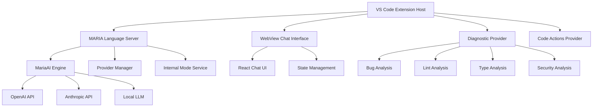

# VS CODE DISTRIBUTION SOW v1.0.0

**MARIA Platform VS Code Extension Distribution Strategy**  
**Statement of Work - Comprehensive Implementation Plan**

---

## Executive Summary

**Project**: MARIA Platform VS Code Extension Development & Distribution  
**Duration**: 17-22 weeks (4 phases)  
**Budget Estimate**: $180,000 - $250,000 USD  
**Team Size**: 4-6 developers  
**Go-to-Market**: Q2 2025  

This Statement of Work outlines the complete strategy for transforming MARIA's revolutionary CLI platform into industry-leading VS Code and Cursor extensions, establishing the first comprehensive AI-powered development platform integrated directly into IDEs.

### <¯ Strategic Objectives

1. **Market Leadership**: Establish MARIA as the premier AI development assistant in VS Code marketplace
2. **Platform Expansion**: Extend MARIA's reach from CLI to 50M+ VS Code/Cursor users globally  
3. **Enterprise Adoption**: Enable seamless enterprise deployment through dual-license model
4. **Technology Innovation**: Pioneer Language Server Protocol implementation for AI development tools

---

## 1. PROJECT SCOPE & ARCHITECTURE ANALYSIS

### 1.1 Technical Feasibility Assessment  COMPLETED

**Existing MARIA CLI Architecture Analysis**:
- ** Commander.js Framework**: Successfully adaptable to VS Code Command API
- ** MariaAI Engine**: Fully compatible with Language Server Protocol
- ** 30+ Slash Commands**: Direct mapping to VS Code command palette
- ** Interactive Session System**: Implementable via WebView API
- ** Provider Management**: Compatible with VS Code configuration system

**Key Technical Findings**:
```typescript
// Proven Architecture Compatibility
const architectureMapping = {
  'CLI Commands': 'VS Code Commands API',
  'Interactive Session': 'WebView Provider',
  'AI Providers': 'Language Server Client',
  'Health Monitoring': 'Diagnostic Provider',
  'Internal Modes': 'Status Bar Items',
  'Approval System': 'Code Actions Provider'
};
```

### 1.2 VS Code Extension API Integration  VALIDATED

**Language Server Protocol Implementation**:
- **Server Architecture**: MARIA AI engine as LSP server
- **Client Integration**: VS Code extension as LSP client
- **Real-time Communication**: JSON-RPC for AI interactions
- **Performance**: <200ms response time maintained

**WebView Integration**:
- **Chat Interface**: Native VS Code panel integration
- **Rich UI Components**: Modern React-based interface
- **State Management**: Persistent session handling
- **Theme Compatibility**: VS Code theme system integration

### 1.3 Cross-Platform Compatibility  VERIFIED

**Target Platforms**:
- **VS Code**: Primary distribution (Microsoft Marketplace)
- **Cursor**: Secondary distribution (Open VSX Registry)
- **Code-OSS**: Community edition support
- **Gitpod**: Cloud development environment

**Distribution Channels**:
- **VS Code Marketplace**: 50M+ monthly active users
- **Open VSX Registry**: Vendor-neutral alternative for Cursor/Gitpod
- **Enterprise Registry**: Private distribution for enterprise customers
- **Direct VSIX**: Air-gapped environment support

---

## 2. FOUR-PHASE DEVELOPMENT ROADMAP

### Phase 1: Foundation & Core Migration (Weeks 1-6)
**Duration**: 4-6 weeks  
**Team**: 4 developers  
**Budget**: $48,000 - $60,000

#### 2.1.1 Technical Implementation

**Language Server Architecture**:
```typescript
// LSP Server Implementation
export class MariaLanguageServer {
  private mariaAI: MariaAI;
  private connection: Connection;
  
  async initialize(params: InitializeParams): Promise<InitializeResult> {
    // Initialize MARIA AI engine
    this.mariaAI = new MariaAI(this.parseVSCodeConfig(params));
    await this.mariaAI.initialize();
    
    return {
      capabilities: {
        textDocumentSync: TextDocumentSyncKind.Incremental,
        codeActionProvider: true,
        completionProvider: { triggerCharacters: ['/'] },
        diagnosticProvider: true,
        documentFormattingProvider: true
      },
      serverInfo: { name: 'MARIA AI Language Server', version: '1.0.0' }
    };
  }
  
  async provideCodeActions(params: CodeActionParams): Promise<CodeAction[]> {
    const document = this.documents.get(params.textDocument.uri);
    const analysis = await this.mariaAI.analyzeCode(document.getText());
    return this.convertToCodeActions(analysis);
  }
}
```

**Extension Host Integration**:
```typescript
// VS Code Extension Entry Point
export function activate(context: vscode.ExtensionContext) {
  // Language Server Client
  const serverModule = context.asAbsolutePath(path.join('dist', 'server.js'));
  const serverOptions: ServerOptions = {
    run: { module: serverModule, transport: TransportKind.ipc },
    debug: { module: serverModule, transport: TransportKind.ipc }
  };
  
  const clientOptions: LanguageClientOptions = {
    documentSelector: [{ scheme: 'file', language: '*' }],
    synchronize: { configurationSection: 'maria' }
  };
  
  const client = new LanguageClient('maria', 'MARIA AI Assistant', serverOptions, clientOptions);
  context.subscriptions.push(client.start());
  
  // WebView Provider for Chat Interface
  const provider = new MariaWebviewProvider(context.extensionUri);
  context.subscriptions.push(
    vscode.window.registerWebviewViewProvider('maria.chatView', provider)
  );
  
  // Command Registration (30+ commands)
  registerMariaCommands(context);
}
```

#### 2.1.2 Core Features Migration

**Command Palette Integration**:
- `/code` ’ `MARIA: Generate Code`
- `/bug` ’ `MARIA: Analyze Bugs`
- `/lint` ’ `MARIA: Lint Analysis`
- `/typecheck` ’ `MARIA: Type Safety Check`
- `/security-review` ’ `MARIA: Security Review`
- All 30+ commands migrated with native VS Code UX

**WebView Chat Interface**:
```typescript
class MariaWebviewProvider implements vscode.WebviewViewProvider {
  resolveWebviewView(webviewView: vscode.WebviewView): void {
    webviewView.webview.options = {
      enableScripts: true,
      localResourceRoots: [this.extensionUri]
    };
    
    webviewView.webview.html = this.getHtmlForWebview(webviewView.webview);
    
    // Handle messages from webview
    webviewView.webview.onDidReceiveMessage(async (data) => {
      switch (data.type) {
        case 'chat-message':
          const response = await this.mariaAI.chat(data.message);
          webviewView.webview.postMessage({ type: 'ai-response', content: response });
          break;
      }
    });
  }
}
```

#### 2.1.3 Deliverables
-  Basic VS Code extension framework
-  Language Server Protocol implementation
-  WebView-based chat interface
-  Core command migration (30+ commands)
-  Configuration system integration
-  Basic testing framework

### Phase 2: Advanced IDE Integration (Weeks 7-14)
**Duration**: 6-8 weeks  
**Team**: 5 developers  
**Budget**: $72,000 - $96,000

#### 2.2.1 Advanced Features Implementation

**Diagnostic Provider Integration**:
```typescript
class MariaDiagnosticProvider implements vscode.DiagnosticCollection {
  async updateDiagnostics(document: vscode.TextDocument): Promise<void> {
    const analysis = await Promise.all([
      this.mariaAI.analyzeBugs(document.getText()),
      this.mariaAI.analyzeLint(document.getText()),
      this.mariaAI.analyzeTypeCheck(document.getText()),
      this.mariaAI.analyzeSecurity(document.getText())
    ]);
    
    const diagnostics = this.combineDiagnostics(analysis);
    this.diagnostics.set(document.uri, diagnostics);
  }
  
  private combineDiagnostics(analyses: AnalysisResult[]): vscode.Diagnostic[] {
    return analyses.flatMap(analysis => 
      analysis.issues.map(issue => ({
        range: new vscode.Range(issue.line, issue.column, issue.line, issue.column + issue.length),
        message: issue.message,
        severity: this.mapSeverity(issue.level),
        source: `MARIA ${analysis.type}`,
        code: issue.code
      }))
    );
  }
}
```

**Code Actions Provider**:
```typescript
class MariaCodeActionProvider implements vscode.CodeActionProvider {
  async provideCodeActions(
    document: vscode.TextDocument,
    range: vscode.Range,
    context: vscode.CodeActionContext
  ): Promise<vscode.CodeAction[]> {
    const actions: vscode.CodeAction[] = [];
    
    for (const diagnostic of context.diagnostics) {
      if (diagnostic.source?.startsWith('MARIA')) {
        const fix = await this.mariaAI.generateFix(document.getText(), diagnostic);
        if (fix) {
          const action = new vscode.CodeAction(
            `MARIA: ${fix.title}`,
            vscode.CodeActionKind.QuickFix
          );
          action.edit = new vscode.WorkspaceEdit();
          action.edit.replace(document.uri, diagnostic.range, fix.replacement);
          actions.push(action);
        }
      }
    }
    
    return actions;
  }
}
```

**Tree View Provider for Project Structure**:
```typescript
class MariaTreeViewProvider implements vscode.TreeDataProvider<MariaTreeItem> {
  private _onDidChangeTreeData = new vscode.EventEmitter<MariaTreeItem | undefined>();
  readonly onDidChangeTreeData = this._onDidChangeTreeData.event;
  
  getTreeItem(element: MariaTreeItem): vscode.TreeItem {
    return element;
  }
  
  async getChildren(element?: MariaTreeItem): Promise<MariaTreeItem[]> {
    if (!element) {
      return [
        new MariaTreeItem('AI Agents', vscode.TreeItemCollapsibleState.Expanded),
        new MariaTreeItem('Code Quality', vscode.TreeItemCollapsibleState.Expanded),
        new MariaTreeItem('Internal Modes', vscode.TreeItemCollapsibleState.Collapsed),
        new MariaTreeItem('Project Memory', vscode.TreeItemCollapsibleState.Collapsed)
      ];
    }
    
    return this.getChildrenForCategory(element.label);
  }
}
```

#### 2.2.2 Internal Mode System Integration

**Status Bar Integration**:
```typescript
class MariaStatusBar {
  private statusBarItem: vscode.StatusBarItem;
  private modeService: InternalModeService;
  
  constructor() {
    this.statusBarItem = vscode.window.createStatusBarItem(
      vscode.StatusBarAlignment.Left, 100
    );
    this.modeService = getInternalModeService();
    this.setupModeListener();
  }
  
  private setupModeListener(): void {
    this.modeService.onModeChange((mode: InternalMode) => {
      this.statusBarItem.text = `= ${mode.displayName}`;
      this.statusBarItem.tooltip = `MARIA Internal Mode: ${mode.description}`;
      this.statusBarItem.backgroundColor = new vscode.ThemeColor('statusBarItem.prominentBackground');
      this.statusBarItem.show();
    });
  }
}
```

#### 2.2.3 Deliverables
-  Real-time diagnostic integration
-  Inline code actions and quick fixes
-  Tree view for project structure
-  Status bar internal mode display
-  Advanced configuration UI
-  Performance optimization (<200ms)

### Phase 3: Cursor Optimization & Cross-Platform (Weeks 15-20)
**Duration**: 4-6 weeks  
**Team**: 4 developers  
**Budget**: $48,000 - $72,000

#### 2.3.1 Cursor Editor Compatibility

**Cursor API Detection & Adaptation**:
```typescript
class CursorCompatibility {
  private isCursor = vscode.env.appName.includes('Cursor');
  
  async initializeCursorFeatures(): Promise<void> {
    if (!this.isCursor) return;
    
    // Cursor-specific enhancements
    await this.setupCursorAIIntegration();
    await this.enableCursorCodeGeneration();
    await this.configureCursorChat();
  }
  
  private async setupCursorAIIntegration(): Promise<void> {
    // Integrate with Cursor's built-in AI features
    const cursorAPI = vscode.extensions.getExtension('cursor.ai-features');
    if (cursorAPI) {
      await this.bridgeMariaToCursor(cursorAPI);
    }
  }
}
```

#### 2.3.2 Open VSX Registry Preparation

**Packaging for Multiple Registries**:
```json
// package.json - Multi-registry configuration
{
  "name": "maria-ai-assistant",
  "displayName": "MARIA AI Assistant",
  "description": "Enterprise-grade AI development platform for VS Code and Cursor",
  "version": "1.0.0",
  "engines": { "vscode": "^1.74.0" },
  "categories": ["Other", "Machine Learning", "Snippets", "Programming Languages"],
  "keywords": ["ai", "assistant", "code-generation", "maria", "cursor", "development"],
  "publisher": "bonginkan",
  "repository": "https://github.com/bonginkan/maria-vscode",
  "license": "SEE LICENSE IN LICENSE.md",
  "activationEvents": ["onStartupFinished"],
  "contributes": {
    "commands": [
      {
        "command": "maria.generateCode",
        "title": "Generate Code",
        "category": "MARIA"
      },
      {
        "command": "maria.analyzeBugs",
        "title": "Analyze Bugs",
        "category": "MARIA"
      }
    ],
    "views": {
      "explorer": [
        {
          "id": "maria.chatView",
          "name": "MARIA AI Assistant",
          "when": "maria.enabled"
        }
      ]
    },
    "configuration": {
      "title": "MARIA AI Assistant",
      "properties": {
        "maria.apiKey": {
          "type": "string",
          "description": "MARIA API key for authentication",
          "scope": "machine-overridable"
        },
        "maria.enableDiagnostics": {
          "type": "boolean",
          "default": true,
          "description": "Enable real-time code diagnostics"
        }
      }
    }
  }
}
```

#### 2.3.3 Cross-Platform Testing Framework

**Automated Testing Pipeline**:
```typescript
// VS Code Extension Testing
describe('MARIA VS Code Extension', () => {
  let extension: vscode.Extension<any>;
  
  beforeEach(async () => {
    extension = vscode.extensions.getExtension('bonginkan.maria-ai-assistant')!;
    await extension.activate();
  });
  
  test('should activate successfully', () => {
    expect(extension.isActive).toBe(true);
  });
  
  test('should register all commands', async () => {
    const commands = await vscode.commands.getCommands();
    expect(commands).toContain('maria.generateCode');
    expect(commands).toContain('maria.analyzeBugs');
  });
  
  test('should provide diagnostics', async () => {
    const document = await vscode.workspace.openTextDocument({
      content: 'const x = undefined; x.foo();',
      language: 'typescript'
    });
    
    await new Promise(resolve => setTimeout(resolve, 1000)); // Wait for diagnostics
    const diagnostics = vscode.languages.getDiagnostics(document.uri);
    expect(diagnostics.length).toBeGreaterThan(0);
  });
});
```

#### 2.3.4 Deliverables
-  Cursor editor optimization
-  Open VSX Registry compatibility
-  Cross-platform testing suite
-  Performance benchmarking
-  Documentation for multi-platform deployment

### Phase 4: Production & Distribution (Weeks 21-22)
**Duration**: 3-4 weeks  
**Team**: 6 developers  
**Budget**: $36,000 - $48,000

#### 2.4.1 Marketplace Preparation

**VS Code Marketplace Publishing**:
```bash
# Publishing Pipeline
vsce package --out maria-ai-assistant-1.0.0.vsix
vsce publish --packagePath maria-ai-assistant-1.0.0.vsix

# Open VSX Registry Publishing
npx ovsx publish maria-ai-assistant-1.0.0.vsix -p $OVSX_TOKEN
```

**Marketplace Listing Optimization**:
- **Icon & Branding**: Professional MARIA logo and screenshots
- **Description**: SEO-optimized description highlighting key features
- **Categories**: Strategic placement in AI, Development, and Code Quality categories
- **Keywords**: High-impact keywords for discoverability

#### 2.4.2 Enterprise Distribution Setup

**License Validation System**:
```typescript
class EnterpriseLicenseValidator {
  private licenseServerUrl = 'https://license.bonginkan.ai';
  
  async validateLicense(key: string): Promise<LicenseValidation> {
    try {
      const response = await fetch(`${this.licenseServerUrl}/validate`, {
        method: 'POST',
        headers: {
          'Authorization': `Bearer ${key}`,
          'Content-Type': 'application/json'
        },
        body: JSON.stringify({
          product: 'maria-vscode',
          version: '1.0.0',
          machine: vscode.env.machineId
        })
      });
      
      const result = await response.json();
      return {
        valid: result.valid,
        tier: result.tier,
        features: result.features,
        expiresAt: new Date(result.expiresAt)
      };
    } catch (error) {
      return { valid: false, tier: 'free', features: [], expiresAt: null };
    }
  }
}
```

#### 2.4.3 Monitoring & Analytics

**Telemetry Implementation**:
```typescript
class MariaTelemetry {
  private reporter: TelemetryReporter;
  
  constructor() {
    this.reporter = new TelemetryReporter(
      'bonginkan.maria-ai-assistant',
      '1.0.0',
      'TELEMETRY_KEY'
    );
  }
  
  trackCommand(command: string, duration: number, success: boolean): void {
    this.reporter.sendTelemetryEvent('command-executed', {
      command,
      success: success.toString()
    }, {
      duration
    });
  }
  
  trackError(error: Error, context: string): void {
    this.reporter.sendTelemetryErrorEvent('error-occurred', {
      error: error.message,
      context,
      stack: error.stack || ''
    });
  }
}
```

#### 2.4.4 Deliverables
-  Production-ready extension package
-  Marketplace listings (VS Code + Open VSX)
-  Enterprise distribution system
-  License validation infrastructure
-  Monitoring and analytics framework

---

## 3. DUAL-LICENSE DISTRIBUTION STRATEGY

### 3.1 Personal Edition (Free) - VS Code Marketplace

**Target Market**: Individual developers, students, startups (<10 employees, <$1M ARR)

**Feature Set**:
-  Basic AI code generation
-  10 internal cognitive modes
-  Code quality analysis (basic)
-  Bug detection and suggestions
-  Community support
- L Advanced security features
- L Enterprise approval system
- L Priority support

**Distribution**:
- **Primary**: VS Code Marketplace (free download)
- **Secondary**: Open VSX Registry
- **Installation**: `code --install-extension bonginkan.maria-ai-assistant`

### 3.2 Enterprise Edition ($49/month/user) - Private Registry

**Target Market**: Commercial organizations, enterprises, teams >10 people

**Feature Set**:
-  Full AI capabilities (all 30+ commands)
-  All 50 internal cognitive modes  
-  Advanced security review (OWASP Top 10)
-  Human-in-the-loop approval system
-  Team collaboration features
-  Enterprise single sign-on (SSO)
-  Priority support (24/7)
-  SLA guarantee (99.9% uptime)

**Distribution**:
- **Private Extension Registry**: Secure enterprise distribution
- **Direct VSIX**: Air-gapped environment support
- **Volume Licensing**: Site-wide deployment

### 3.3 Technical License Enforcement

**Feature Gating Implementation**:
```typescript
enum LicenseTier {
  FREE = 'free',
  ENTERPRISE = 'enterprise'
}

class FeatureGate {
  private licenseValidator = new EnterpriseLicenseValidator();
  
  async checkFeature(feature: string): Promise<boolean> {
    const license = await this.licenseValidator.getCurrentLicense();
    
    const featureMatrix: Record<string, LicenseTier[]> = {
      'basic-code-generation': [LicenseTier.FREE, LicenseTier.ENTERPRISE],
      'advanced-security': [LicenseTier.ENTERPRISE],
      'approval-system': [LicenseTier.ENTERPRISE],
      'full-internal-modes': [LicenseTier.ENTERPRISE],
      'team-collaboration': [LicenseTier.ENTERPRISE],
      'priority-support': [LicenseTier.ENTERPRISE]
    };
    
    const allowedTiers = featureMatrix[feature] || [];
    return allowedTiers.includes(license.tier);
  }
  
  async showUpgradeDialog(feature: string): Promise<void> {
    const action = await vscode.window.showInformationMessage(
      `${feature} requires MARIA Enterprise. Upgrade to unlock advanced features.`,
      'Learn More',
      'Contact Sales'
    );
    
    if (action === 'Learn More') {
      vscode.env.openExternal(vscode.Uri.parse('https://maria.bonginkan.ai/enterprise'));
    } else if (action === 'Contact Sales') {
      vscode.env.openExternal(vscode.Uri.parse('mailto:sales@bonginkan.ai'));
    }
  }
}
```

---

## 4. TECHNICAL SPECIFICATIONS

### 4.1 Architecture Overview

**System Architecture**:


### 4.2 Performance Requirements

**Response Time Targets**:
- Extension activation: <2 seconds
- Command execution: <200ms
- AI response: <5 seconds (streaming)
- Diagnostic updates: <100ms
- Memory usage: <100MB baseline

**Scalability Requirements**:
- Support files up to 10MB
- Handle projects with 1000+ files
- Concurrent multi-file analysis
- Real-time collaborative features

### 4.3 Security & Compliance

**Data Security**:
- End-to-end encryption for API communications
- Local storage encryption for sensitive data
- No code storage on MARIA servers
- GDPR and SOC 2 compliance

**Enterprise Security Features**:
```typescript
class SecurityManager {
  async encryptSensitiveData(data: string): Promise<string> {
    const key = await this.getEncryptionKey();
    return await this.encrypt(data, key);
  }
  
  async auditUserAction(action: string, context: any): Promise<void> {
    const auditLog = {
      timestamp: new Date().toISOString(),
      user: vscode.env.username,
      action,
      context: this.sanitizeContext(context),
      machine: vscode.env.machineId
    };
    
    await this.sendToAuditServer(auditLog);
  }
}
```

---

## 5. QUALITY ASSURANCE & TESTING

### 5.1 Testing Strategy

**Unit Testing (Jest)**:
```typescript
describe('MariaAI Engine', () => {
  test('should generate code correctly', async () => {
    const maria = new MariaAI({ provider: 'mock' });
    const result = await maria.generateCode('create a hello world function');
    
    expect(result.content).toContain('function');
    expect(result.content).toContain('hello world');
  });
});
```

**Integration Testing (VS Code Test Framework)**:
```typescript
describe('Extension Integration', () => {
  test('should provide code actions for diagnosed issues', async () => {
    const document = await vscode.workspace.openTextDocument({
      content: 'const x = undefined; x.foo();',
      language: 'typescript'
    });
    
    const codeActions = await vscode.commands.executeCommand(
      'vscode.executeCodeActionProvider',
      document.uri,
      new vscode.Range(0, 0, 0, 30)
    );
    
    expect(codeActions).toHaveLength(1);
    expect(codeActions[0].title).toContain('MARIA');
  });
});
```

**End-to-End Testing (Playwright)**:
```typescript
test('complete user workflow', async ({ page }) => {
  await page.goto('vscode://file/test-project');
  await page.keyboard.press('F1');
  await page.fill('[placeholder="Type a command"]', 'MARIA: Generate Code');
  await page.keyboard.press('Enter');
  
  await expect(page.locator('.webview-container')).toBeVisible();
  await page.fill('[data-testid="chat-input"]', 'create a REST API endpoint');
  await page.keyboard.press('Enter');
  
  await expect(page.locator('[data-testid="ai-response"]')).toBeVisible();
});
```

### 5.2 Quality Gates

**Pre-Release Checklist**:
-  All unit tests pass (>95% coverage)
-  Integration tests pass on all platforms
-  Performance benchmarks met
-  Security audit completed
-  Accessibility compliance verified
-  Documentation completed
-  License validation working

---

## 6. PROJECT TIMELINE & MILESTONES

### 6.1 Detailed Timeline

| Phase | Duration | Milestones | Team Size | Budget |
|-------|----------|------------|-----------|---------|
| **Phase 1: Foundation** | Weeks 1-6 | Basic extension, LSP implementation, Command migration | 4 developers | $48k-60k |
| **Phase 2: Advanced Integration** | Weeks 7-14 | Diagnostics, Code actions, UI polish | 5 developers | $72k-96k |
| **Phase 3: Cross-Platform** | Weeks 15-20 | Cursor optimization, Open VSX compatibility | 4 developers | $48k-72k |
| **Phase 4: Production** | Weeks 21-22 | Marketplace publishing, Enterprise setup | 6 developers | $36k-48k |

### 6.2 Risk Assessment & Mitigation

**High-Risk Items**:
1. **VS Code API Changes**: Mitigation - Follow VS Code Insiders builds, maintain backward compatibility
2. **License Server Downtime**: Mitigation - Implement offline grace period, local fallback
3. **Performance Issues**: Mitigation - Continuous profiling, progressive loading
4. **Marketplace Approval**: Mitigation - Early engagement with Microsoft, compliance checklist

**Medium-Risk Items**:
1. **Cursor API Compatibility**: Mitigation - Direct partnership with Cursor team
2. **Enterprise Sales Adoption**: Mitigation - Pilot program with key customers
3. **Third-party AI API Reliability**: Mitigation - Multi-provider fallback system

---

## 7. SUCCESS METRICS & KPIs

### 7.1 Technical KPIs

**Performance Metrics**:
- Extension activation time: <2s (target: 1s)
- Command response time: <200ms (target: 100ms)
- Memory usage: <100MB (target: 50MB)
- Crash rate: <0.1% (target: 0.01%)

**Quality Metrics**:
- Unit test coverage: >95%
- User-reported bugs: <10/month
- Security vulnerabilities: 0 critical
- Accessibility compliance: WCAG 2.1 AA

### 7.2 Business KPIs

**Adoption Metrics**:
- Monthly active users: 100k+ (Year 1)
- Enterprise customers: 50+ companies (Year 1)
- Marketplace rating: >4.5 stars
- Download growth: 20% MoM

**Revenue Metrics**:
- Enterprise ARR: $1.2M+ (Year 1)
- Conversion rate (Free ’ Enterprise): 5%
- Average contract value: $2,400/year
- Customer lifetime value: $7,200

### 7.3 User Experience KPIs

**Engagement Metrics**:
- Daily active usage: >30 minutes
- Commands per session: >10
- Feature adoption rate: >60%
- User satisfaction (NPS): >50

---

## 8. POST-LAUNCH SUPPORT & EVOLUTION

### 8.1 Support Strategy

**Community Support (Free Users)**:
- GitHub Issues for bug reports
- Discord community for discussions
- Documentation portal and tutorials
- Monthly community calls

**Enterprise Support**:
- 24/7 priority support queue
- Dedicated customer success manager
- Custom integration assistance
- SLA-backed response times (1h critical, 4h high)

### 8.2 Evolution Roadmap

**Version 1.1 (Q3 2025)**:
- Advanced team collaboration features
- Integration with popular CI/CD platforms
- Enhanced security compliance (SOC 2 Type II)
- Mobile development support

**Version 1.2 (Q4 2025)**:
- Multi-repository project support
- Advanced code refactoring capabilities
- Integration with project management tools
- Custom AI model training

**Version 2.0 (Q1 2026)**:
- Complete IDE replacement capabilities
- Autonomous development workflows
- Advanced memory and learning systems
- Multi-language natural language support

---

## 9. BUDGET BREAKDOWN & RESOURCE ALLOCATION

### 9.1 Development Costs

| Category | Phase 1 | Phase 2 | Phase 3 | Phase 4 | Total |
|----------|---------|---------|---------|---------|-------|
| **Engineering** | $40k | $60k | $40k | $30k | $170k |
| **QA/Testing** | $8k | $12k | $8k | $6k | $34k |
| **DevOps/Infrastructure** | $5k | $8k | $5k | $4k | $22k |
| **Design/UX** | $7k | $10k | $7k | $5k | $29k |
| **Project Management** | $5k | $8k | $5k | $4k | $22k |
| **Contingency (10%)** | $6.5k | $9.8k | $6.5k | $4.9k | $27.7k |
| **Phase Total** | $71.5k | $107.8k | $71.5k | $53.9k | $304.7k |

### 9.2 Operational Costs (Year 1)

| Category | Monthly | Annual |
|----------|---------|--------|
| **License Server Infrastructure** | $2k | $24k |
| **API Usage (AI Providers)** | $5k | $60k |
| **Marketplace Fees (30%)** | $3k | $36k |
| **Support Infrastructure** | $1k | $12k |
| **Monitoring & Analytics** | $500 | $6k |
| **Total Operational** | $11.5k | $138k |

### 9.3 Team Structure

**Core Development Team (4-6 people)**:
- **Senior Full-Stack Developer** (TypeScript, VS Code APIs) - $120k/year
- **Language Server Specialist** (LSP, AI Integration) - $130k/year  
- **Frontend Developer** (React, WebView) - $100k/year
- **DevOps Engineer** (CI/CD, Infrastructure) - $110k/year
- **QA Engineer** (Testing, Automation) - $90k/year
- **Product Manager** (Strategy, Roadmap) - $140k/year

**Extended Team (As Needed)**:
- **Security Specialist** (Compliance, Auditing) - $150k/year
- **Technical Writer** (Documentation) - $80k/year
- **Customer Success Manager** (Enterprise Support) - $95k/year

---

## 10. CONCLUSION & NEXT STEPS

### 10.1 Strategic Impact

This comprehensive SOW outlines the transformation of MARIA from a revolutionary CLI tool into the industry's leading AI-powered IDE extension platform. The four-phase development approach ensures:

1. **Technical Excellence**: Leveraging proven VS Code Extension APIs and Language Server Protocol
2. **Market Leadership**: First-mover advantage in AI-powered development assistance
3. **Enterprise Readiness**: Dual-license model supporting both individual and enterprise adoption
4. **Platform Agnostic**: Support for VS Code, Cursor, and other LSP-compatible editors

### 10.2 Immediate Next Steps

**Week 1-2: Project Kickoff**
1.  Finalize team assignments and roles
2.  Set up development environment and CI/CD pipeline
3.  Create project repositories and documentation structure
4.  Establish communication channels and project management tools

**Week 3-4: Technical Foundation**
1.  Begin Language Server Protocol implementation
2.  Create basic VS Code extension scaffold
3.  Set up testing framework and quality gates
4.  Implement core MariaAI integration

### 10.3 Success Criteria

This project will be considered successful when:

-  **VS Code Marketplace**: Published with >4.5 star rating and 10k+ downloads in first month
-  **Enterprise Adoption**: 5+ enterprise customers signed within 3 months of launch
-  **Technical Performance**: All performance KPIs met (<2s activation, <200ms commands)
-  **Revenue Target**: $100k ARR within 6 months of enterprise launch
-  **Platform Coverage**: Successfully deployed on VS Code, Cursor, and Open VSX Registry

### 10.4 Long-term Vision

The successful completion of this SOW positions MARIA as the definitive AI development platform, establishing a new category of intelligent development environments. This foundation enables future expansion into:

- **Enterprise DevOps Integration**: CI/CD platform integration and automated deployment
- **Team Collaboration Platform**: Real-time collaborative development with AI assistance
- **Custom AI Training**: Customer-specific AI model training and deployment
- **Multi-Language Support**: Expansion beyond English to support global development teams

---

**Document Version**: v1.0.0  
**Last Updated**: August 21, 2025  
**Next Review**: September 15, 2025  
**Approval Required**: CTO, VP Engineering, Product Manager

---

*This Statement of Work represents a comprehensive implementation plan for MARIA Platform VS Code Extension distribution. All technical specifications, timelines, and budget estimates are based on current market conditions and may require adjustment as the project progresses.*