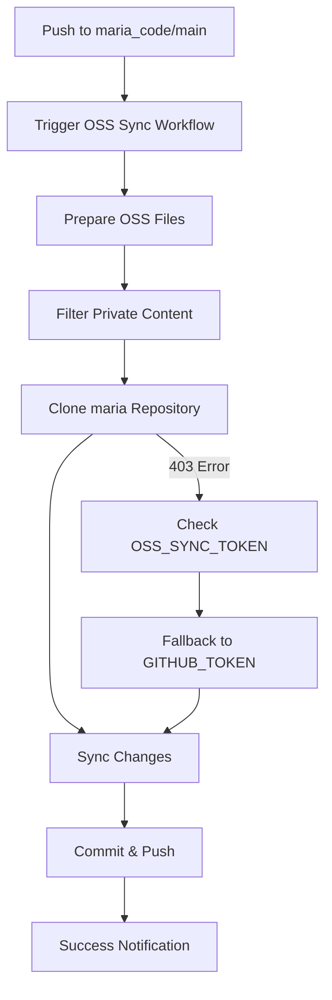

# 🔄 OSS Repository Sync Setup Guide

This guide explains how to set up the automated synchronization between the private `maria_code` repository and the public `maria` OSS repository.

## 🎯 Overview

The OSS sync system automatically:

- Syncs code changes from `maria_code` (private) → `maria` (public)
- Filters out internal/private files and configurations
- Maintains clean OSS distribution with proper package.json
- Preserves git history and commit messages

## 🔑 Authentication Setup

### Required GitHub Secrets

#### 1. OSS_SYNC_TOKEN (Recommended)

Create a Personal Access Token (Classic) with repository access:

```bash
# 1. Go to GitHub Settings → Developer settings → Personal access tokens → Tokens (classic)
# 2. Generate new token (classic)
# 3. Select scopes:
#    ✅ repo (Full control of private repositories)
#    ✅ public_repo (Access public repositories)
#    ✅ workflow (Update GitHub Action workflows)
# 4. Copy the token
```

Add to GitHub Secrets:

```bash
# Repository: bonginkan/maria_code
# Settings → Secrets and variables → Actions → New repository secret
Name: OSS_SYNC_TOKEN
Secret: [your-personal-access-token]
```

#### 2. GITHUB_TOKEN (Fallback)

- Automatically available in GitHub Actions
- Limited to public repositories only
- Used as fallback when OSS_SYNC_TOKEN is not available

### Token Verification

```bash
# Test OSS_SYNC_TOKEN access
curl -H "Authorization: token YOUR_TOKEN" \
  https://api.github.com/repos/bonginkan/maria

# Should return repository information
```

## ⚙️ Workflow Configuration

### Trigger Conditions

```yaml
on:
  push:
    branches:
      - main
    paths-ignore:
      - '.github/workflows/sync-to-oss.yml'
      - 'maria-code-lp/**'
      - 'packages/studio-app/**'
      - 'packages/core-api/**'
      - 'infra/**'
  workflow_dispatch:
    inputs:
      force:
        description: 'Force sync even if no changes detected'
        required: false
        default: 'false'
```

### File Filtering

Files automatically excluded from OSS sync:

- Internal documentation (`*.internal.md`)
- Studio app (`packages/studio-app/**`)
- Core API (`packages/core-api/**`)
- Infrastructure (`infra/**`)
- Landing page (`maria-code-lp/**`)

### OSS Package Preparation

```bash
# Automatically removes private fields
delete pkg.private
delete pkg.workspaces

# Updates package information
pkg.name = '@bonginkan/maria'
pkg.homepage = 'https://github.com/bonginkan/maria'
pkg.repository.url = 'git+https://github.com/bonginkan/maria.git'
```

## 🔧 Manual Sync

### Force Sync via GitHub Actions

```bash
# Trigger manual sync
gh workflow run sync-to-oss.yml --ref main -f force=true
```

### Local Testing

```bash
# Test sync logic locally
cd maria_code
mkdir -p /tmp/test-sync

# Copy OSS files
if [ -d "maria-oss" ]; then
  cp -r maria-oss/* /tmp/test-sync/
fi

# Copy essential files
cp -r src /tmp/test-sync/
cp -r bin /tmp/test-sync/
cp -r dist /tmp/test-sync/
cp package.json /tmp/test-sync/

# Verify structure
ls -la /tmp/test-sync/
```

## 🚨 Troubleshooting

### Common Issues

#### 1. 403 Permission Denied

```bash
# Check if OSS_SYNC_TOKEN is set
gh secret list --repo bonginkan/maria_code | grep OSS_SYNC_TOKEN

# Verify token permissions
curl -H "Authorization: token YOUR_TOKEN" \
  https://api.github.com/user

# Make sure token has 'repo' scope
```

#### 2. Repository Not Found

```bash
# Verify repository exists and is accessible
gh repo view bonginkan/maria

# Check repository visibility (should be public)
gh api repos/bonginkan/maria | jq '.private'
# Should return: false
```

#### 3. Authentication Fallback Issues

```bash
# Check workflow logs for authentication method used
# Should see: "🔑 Using OSS_SYNC_TOKEN for authentication"
# If fallback: "🔑 Using GITHUB_TOKEN for authentication (public repos only)"
```

#### 4. File Sync Issues

```bash
# Check if required files exist in source
ls -la maria_code/src/
ls -la maria_code/bin/
ls -la maria_code/dist/

# Verify maria-oss directory structure
ls -la maria_code/maria-oss/
```

### Debug Commands

```bash
# Check workflow status
gh run list --workflow=sync-to-oss.yml --limit 5

# View specific run details
gh run view RUN_ID --log

# Check repository permissions
gh api repos/bonginkan/maria_code/collaborators/USERNAME/permission

# Test git operations manually
git clone https://github.com/bonginkan/maria.git /tmp/test-maria
cd /tmp/test-maria
git remote -v
```

## 📊 Monitoring

### Successful Sync Indicators

- ✅ Workflow completes without errors
- ✅ New commit appears in `bonginkan/maria`
- ✅ Commit message includes sync metadata
- ✅ Package version updated correctly

### Sync Validation

```bash
# Compare file counts (rough check)
find maria_code/src -name "*.ts" | wc -l
find maria/src -name "*.ts" | wc -l

# Check latest sync commit
cd maria
git log --oneline -1
# Should show: "🔄 Sync from maria_code@XXXXXX"

# Verify package.json is OSS-ready
grep -E "private|workspaces" package.json
# Should return no results
```

## 🔄 Sync Process Flow



## 🔮 Advanced Configuration

### Custom File Filtering

Edit `.github/workflows/sync-to-oss.yml`:

```yaml
paths-ignore:
  - 'custom-private-dir/**'
  - '*.private.*'
  - 'internal-docs/**'
```

### Repository Settings

```bash
# Enable/disable sync
# Create .github/sync-disabled file to temporarily disable
touch .github/sync-disabled

# Custom sync configuration
# Edit .github/oss-sync-config.json
{
  "exclude_patterns": ["*.internal.*"],
  "include_patterns": ["src/**", "bin/**"],
  "auto_create_releases": true
}
```

### Multiple OSS Repositories

For syncing to multiple OSS repos:

```yaml
strategy:
  matrix:
    repo:
      - bonginkan/maria
      - bonginkan/maria-cli
      - bonginkan/maria-tools
```

---

**Last Updated**: 2025-08-15  
**Author**: MARIA Development Team  
**Status**: Production Ready 🚀
